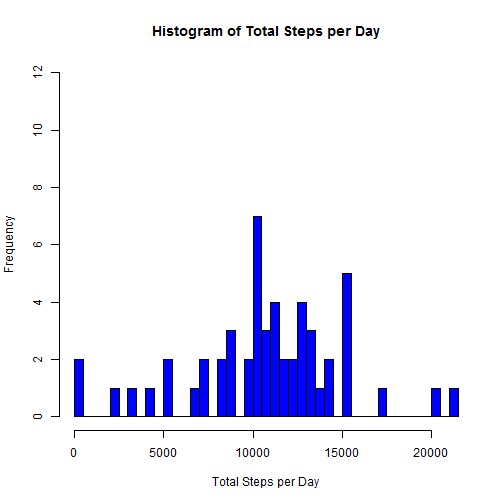
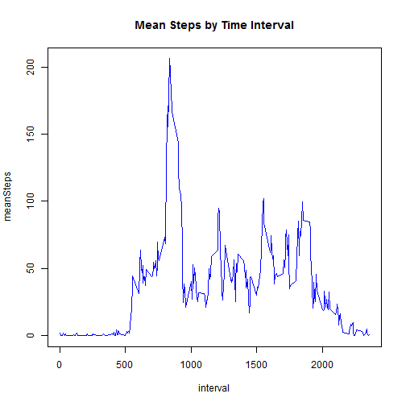
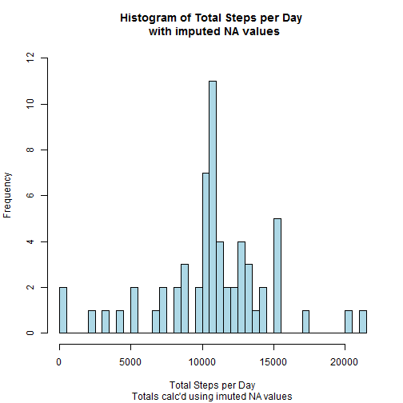
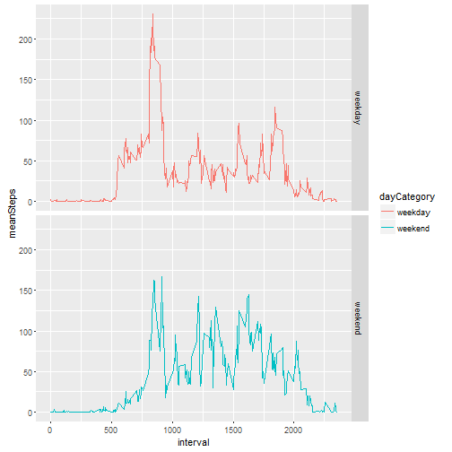

Reproducible Research: Assignment1
=====================================

### This is the first project in John's Hopkin's Reproducible Research course. The goal is to perform a short analysis of an activity monitoring device and generate a markdown/HTML report using R markdown and knitter.

## Part 1: loading and preprocessing the data.  

### Load the Data: 
   * This code downloads and unzips the data then loads it into a      dataFrame called "activity"  
   * This code chunck also loads a few librarys I will use later in the analysis.  I used {r, message=F, warning=F} to supress messages associated with the libary loads.


```r
if (file.exists("activity.csv") != TRUE)  {
        fileURL <- "https://d396qusza40orc.cloudfront.net/repdata%2Fdata%2Factivity.zip"
        
        download.file(fileURL, destfile = "activity.zip")
        
        unzip("activity.zip")
}

library(lubridate)
library(plyr)
library(dplyr)
library(ggplot2)

activity <- read.csv("activity.csv", na.strings = "NA") 
head(activity)
```

```
##   steps       date interval
## 1    NA 2012-10-01        0
## 2    NA 2012-10-01        5
## 3    NA 2012-10-01       10
## 4    NA 2012-10-01       15
## 5    NA 2012-10-01       20
## 6    NA 2012-10-01       25
```

### Process/transform the data (if necessary) into a format suitable for your analysis  

* The data was in pretty good shape. The only processing step I performed was to translate the "date" column from character string to date format using lubridate. 


```r
activity$date <- ymd(activity$date)
```

## Part 2: What is mean total number of steps taken per day?

### Make a histogram of the total number of steps taken each day  

* This code chunk calculates the total number of steps taken for each day in the dataset and plots the data a histogram:


```r
#----------------Calculate and graph total steps for each day---------------------------
#calculate total steps for each day in the dataset
stepsByDay <- activity %>% group_by(date) %>%
                summarize(sum(steps))
names(stepsByDay) <- c("date","steps")

#plot Histogram
hist(stepsByDay$steps, 
     col = "blue", 
     breaks = 50,
     main = "Histogram of Total Steps per Day",
     xlab = "Total Steps per Day",
     ylim = c(0,12))
```



### Calculate and report the mean and median total number of steps taken per day  


```r
 #calculate medain and mean steps per day and print.
meanSteps = mean(stepsByDay$steps, na.rm = TRUE)
medianSteps = median(stepsByDay$steps, na.rm = TRUE)
print (c(meanSteps, medianSteps))
```

```
## [1] 10766.19 10765.00
```

* the mean number of steps taken each day is 1.0766189 &times; 10<sup>4</sup> and the median number of steps taken each day is 10765


## Part 3: What is the average daily activity pattern?  

### Make a time series plot (i.e. type = "l") of the 5-minute interval (x-axis) and the average number of steps taken, averaged across all days (y-axis)  

* This code chunk first calculates the mean number of steps taken for each 5 minute time interval then makes a line plot using the base plotting system.


```r
#------------------Calculate and Plot average number of steps for each time interval-----
dailyActivity <- activity %>%
                 #mutate( weekday = wday(date, label = TRUE)) %>%
                 group_by(interval) %>%
                 summarize(mean(steps, na.rm=TRUE))
names(dailyActivity) <- c("interval","meanSteps")   

with(dailyActivity, plot(interval, meanSteps, 
                         type = 'l', 
                         col = "blue",
                         lwd = 1.75,
                         main = "Mean Steps by Time Interval"))
```



### Which 5-minute interval, on average across all the days in the dataset, contains the maximum number of steps?  

* The Plot above illustrates that the maximum number of steps is slightly larger than 200 occuring approximately at interval 800.  The following code finds the exact values.


```r
maxInterval <- dailyActivity[dailyActivity$meanSteps == 
                      max(dailyActivity$meanSteps, na.rm=TRUE), ]
print (maxInterval)
```

```
## Source: local data frame [1 x 2]
## 
##   interval meanSteps
##      (int)     (dbl)
## 1      835  206.1698
```
* So the inital estimate was pretty close, with the actual max of 206.1698113 at interval 835

## Part 4: Imputing missing values  

### Calculate and report the total number of missing values in the dataset (i.e. the total number of rows with NAs)


```r
nulls <- sum(is.na(activity$steps))
summary(activity)
```

```
##      steps             date               interval     
##  Min.   :  0.00   Min.   :2012-10-01   Min.   :   0.0  
##  1st Qu.:  0.00   1st Qu.:2012-10-16   1st Qu.: 588.8  
##  Median :  0.00   Median :2012-10-31   Median :1177.5  
##  Mean   : 37.38   Mean   :2012-10-31   Mean   :1177.5  
##  3rd Qu.: 12.00   3rd Qu.:2012-11-15   3rd Qu.:1766.2  
##  Max.   :806.00   Max.   :2012-11-30   Max.   :2355.0  
##  NA's   :2304
```

* As the summary above shows, the total number of NA's in the dataset is 2304

### Devise a strategy for filling in all of the missing values in the dataset. The strategy does not need to be sophisticated. For example, you could use the mean/median for that day, or the mean for that 5-minute interval, etc.  

* For this section, I will fill in the missing NA's using the mean value of the given time interval for each NA.  These values have already been calculated and are stored in "dailyActivity." So, for example, looking at the header data below:

```r
head(activity)
```

```
##   steps       date interval
## 1    NA 2012-10-01        0
## 2    NA 2012-10-01        5
## 3    NA 2012-10-01       10
## 4    NA 2012-10-01       15
## 5    NA 2012-10-01       20
## 6    NA 2012-10-01       25
```

```r
head(dailyActivity)
```

```
## Source: local data frame [6 x 2]
## 
##   interval meanSteps
##      (int)     (dbl)
## 1        0 1.7169811
## 2        5 0.3396226
## 3       10 0.1320755
## 4       15 0.1509434
## 5       20 0.0754717
## 6       25 2.0943396
```
 * The first row of "activity" contains a null value in "steps".  This will be filled with 1.717, the corresponding mean value for interval 0 from "dailyActivity"


### Create a new dataset that is equal to the original dataset but with the missing data filled in.


```r
activityFilled <- join(activity, dailyActivity, by = "interval")

#select all null values of steps                       
nulls<- is.na(activityFilled$steps)

#replace null step values with the average for each interval
activityFilled[nulls,"steps"] <- activityFilled[nulls, "meanSteps"]
head(activityFilled)
```

```
##       steps       date interval meanSteps
## 1 1.7169811 2012-10-01        0 1.7169811
## 2 0.3396226 2012-10-01        5 0.3396226
## 3 0.1320755 2012-10-01       10 0.1320755
## 4 0.1509434 2012-10-01       15 0.1509434
## 5 0.0754717 2012-10-01       20 0.0754717
## 6 2.0943396 2012-10-01       25 2.0943396
```

### Make a histogram of the total number of steps taken each day and Calculate and report the mean and median total number of steps taken per day. Do these values differ from the estimates from the first part of the assignment? What is the impact of imputing missing data on the estimates of the total daily number of steps?


```r
#repeat summary and histogram from part 1 with all NA's filled.
stepsByDayFilled <- activityFilled %>% group_by(date) %>%
        summarize(sum(steps))
names(stepsByDayFilled) <- c("date","steps")

hist(stepsByDayFilled$steps, 
     col = "lightblue", 
     breaks = 50,
     main = "Histogram of Total Steps per Day \n with imputed NA values",
     sub = "Totals calc'd using imuted NA values",
     xlab = "Total Steps per Day",
     ylim = c(0,12))
```



```r
meanStepsFilled = mean(stepsByDayFilled$steps, na.rm = TRUE)
medianStepsFilled = median(stepsByDayFilled$steps, na.rm = TRUE)
print (c(meanStepsFilled, medianStepsFilled))
```

```
## [1] 10766.19 10766.19
```

* **Mean:** Imputing missing data using interval means does not change the mean of 10766.19 the dataset.  This makes sense if one inspects the distribution of the NA's.  The Null values compose blocks of individual days i.e days that the individual did not wear the device.  Because of this, filling NA's with interval means for an entire day will not change the mean of the dataset.  If the NA's were clustered around a specific time like Mid-Morning or late night this would not be the case. 
* **Median:** Because values were added to the dataset, the Medain does change from 10765 to 10766.19.  This new value is again an artifact of the NA's falling in full-day blocks.  The day that now falls in the median position was an NA day.  Since it is filled with mean interval values, the mean of those means is the same as the mean of the dataset.  Therefore mean = medain in this imputed dataset.

## Part 5: Are there differences in activity patterns between weekdays and weekends?  

### Create a new factor variable in the dataset with two levels -- "weekday" and "weekend" indicating whether a given date is a weekday or weekend day.  

* Assignment instructions specify using the imputed dataset for this section.

* the following code creates a character variable called dayCategory that contains "weekday"" or "weekend".  This varible is converted to a factor after summarizing the data in the next code chunk.


```r
#--------------------weekend vs weekday-------------------------------------------------
#first extract weekday abbreviation and number from the date column
activityFilled$weekday <- wday(activityFilled$date)
activityFilled$dayAbrev <- wday(activityFilled$date, label = TRUE)

#next use the mapvalues function to create a "dayCategory" variable containing "weekday" or "weekend"
dayCategory <- c('weekend', 'weekday','weekday','weekday','weekday','weekday', 'weekend')
day <- c(1:7)
activityFilled$dayCategory <- mapvalues(activityFilled$weekday,
                                  from = day,
                                  to = dayCategory)

head(activityFilled)
```

```
##       steps       date interval meanSteps weekday dayAbrev dayCategory
## 1 1.7169811 2012-10-01        0 1.7169811       2      Mon     weekday
## 2 0.3396226 2012-10-01        5 0.3396226       2      Mon     weekday
## 3 0.1320755 2012-10-01       10 0.1320755       2      Mon     weekday
## 4 0.1509434 2012-10-01       15 0.1509434       2      Mon     weekday
## 5 0.0754717 2012-10-01       20 0.0754717       2      Mon     weekday
## 6 2.0943396 2012-10-01       25 2.0943396       2      Mon     weekday
```

### Make a panel plot containing a time series plot (i.e. type = "l") of the 5-minute interval (x-axis) and the average number of steps taken, averaged across all weekday days or weekend days (y-axis).   


```r
#now calculate the average steps per interval, discriminated by the dayCategory variable
weeklyActivity <- activityFilled %>%
        group_by(dayCategory, interval) %>%
        summarize(mean(steps, na.rm=TRUE))

#clean up names and convert to factor
names(weeklyActivity) <- c('dayCategory', 'interval', 'meanSteps')
weeklyActivity$dayCategory <- as.factor(weeklyActivity$dayCategory)

#generate panel plot using ggplot2
g <- ggplot(weeklyActivity, aes(interval, meanSteps, color = dayCategory))
g + geom_line() + 
    facet_grid(dayCategory~.)
```




* This plot shows that there are differences between Weekend and Weekday activity.  On average, activity begins earlier in the morning during the week and has a higher peak, but activity stays more constant throughout the day on the weekends.

## The End. Thanks for reading!


